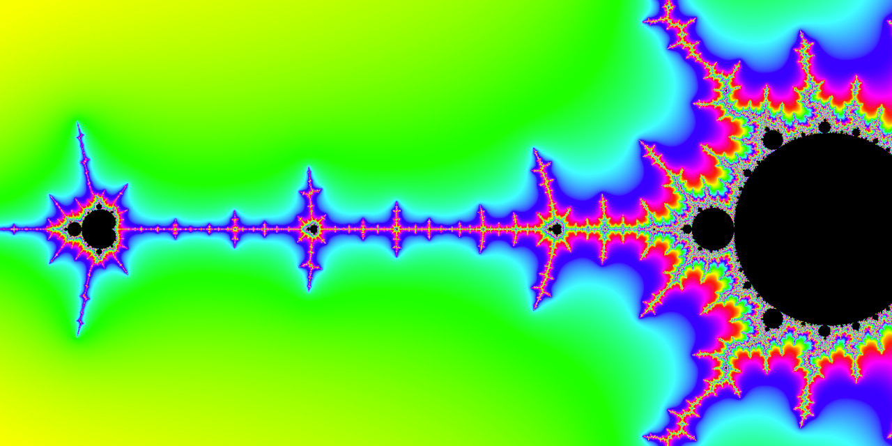

# An Explorable WebGL Mandelbrot Renderer



This one has been a bit of a headache to make. Not the actual rendering of the set, but making it so you can drag and zoom was a bit trickly.

Anyway, it's a renderer that lets you explore the mandelbrot set with your GPU by dragging around and scrolling, accelerated by WebGL, meaning so long as you have semi-decent GPU hardware, you can get a very smooth experience. Oh also I wrote the core of the code in Rust (the logical choice for web development). Slight disclaimer though: **you can't zoom in that far because floating point precision starts to have some issues and turn the visualization into a blocky mess. Sorry, but there's not much I can do about that.**

## Usage
https://benjaminhinchliff.github.io/webgl-mandelbrot/

## Testing/Compilation
To run the development server use:
```
npm run serve
```

To compile the code use:
```
npm run build
```

## TODO(s):

- Testing? I would really like to have it but I really have no idea how to test WebGL code without something stupid like image comparison or a really massive mock that just makes you write the code twice. Let me know if you know a good way to do this.
